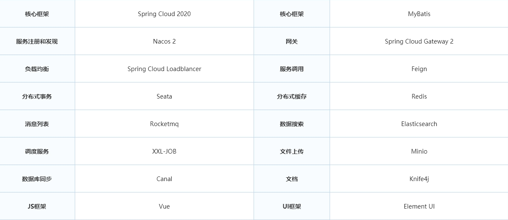
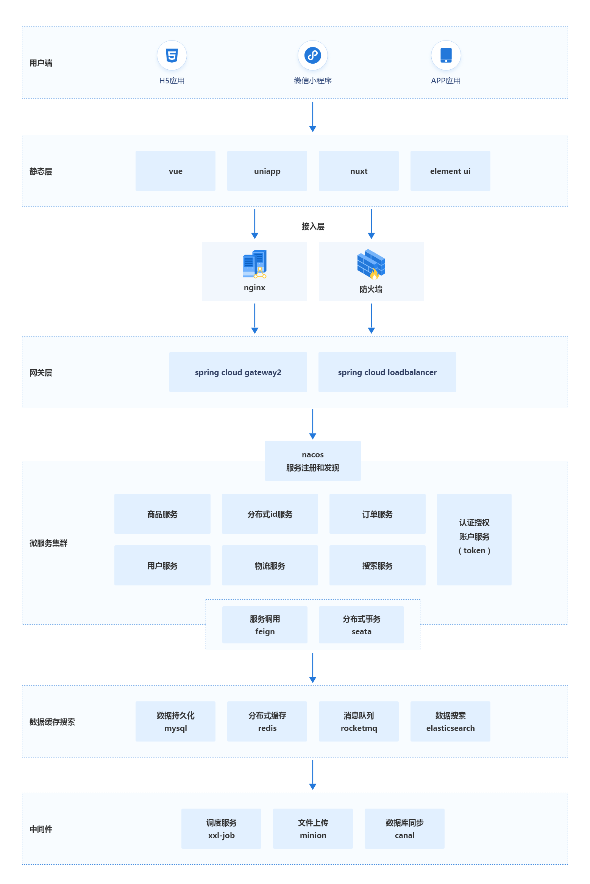
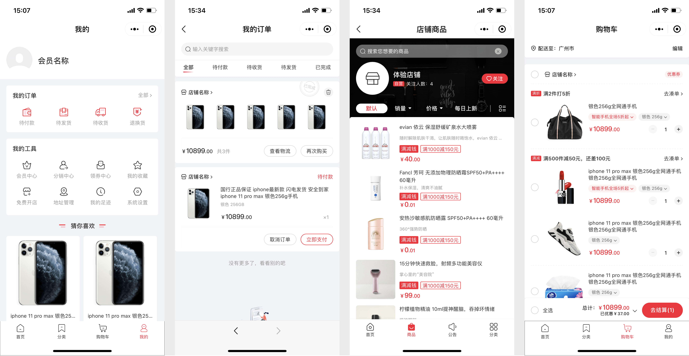

一个基于Spring Cloud、Nacos、Seata、Mysql、Redis、RocketMQ、canal、ElasticSearch、minio的微服务B2B2C电商商城系统，采用主流的互联网技术架构、全新的UI设计、支持集群部署、服务注册和发现以及拥有完整的订单流程等，代码完全开源，没有任何二次封装，是一个非常适合二次开发的电商平台系统。


## 前言

本商城致力于为中大型企业打造一个功能完整、易于维护的微服务B2B2C电商商城系统，采用主流微服务技术实现。后台管理系统包含平台管理，店铺管理、商品管理、订单管理、规格管理、权限管理、资源管理等模块。

## 文档

这代码有没有文档呀？ 当然有啦，你已经下载了，在doc这个文件夹上，实在不知道，我就给链接出来咯：

gitee：https://gitee.com/gz-yami/mall4cloud/tree/master/doc

**开发环境搭建视频（推荐先看下文档再看视频）：https://www.bilibili.com/video/BV1TK411C7aV** 

有声音了。如果视频对你有用，记得点赞投币噢。 

本项目是一个极度遵守阿里巴巴代码规约的项目，以下是代码规约扫描结果


具体目录结构和代码规范，可以查看 https://gitee.com/gz-yami/mall4cloud/tree/master/doc/%E4%BB%A3%E7%A0%81%E7%9B%AE%E5%BD%95%E7%BB%93%E6%9E%84

## 授权

除开源版本外，本商城还提供商业版本的商城，欲知详情，请访问官网。

商城官网：https://www.mall4j.com

商城使用 AGPLv3 开源，请遵守 AGPLv3 的相关条款，或者联系作者获取商业授权(https://www.mall4j.com)

## 项目链接

JAVA后台：https://gitee.com/gz-yami/mall4cloud

平台端：https://gitee.com/gz-yami/mall4cloud-platform

商家端：https://gitee.com/gz-yami/mall4cloud-multishop

uni-app：https://gitee.com/gz-yami/mall4cloud-uniapp

## 演示地址

商业版演示地址：

pc端：https://cloud-pc.mall4j.com

H5端：https://h5.mall4j.com/cloud

商业版小程序演示


## 目录结构规范

我们也有自己的目录结构


- VO（View Object）：显示层对象，通常是 Web 向模板渲染引擎层传输的对象。
- DTO（Data Transfer Object）：数据传输对象，前端像后台进行传输的对象，类似于param。
- BO（Business Object）：业务对象，内部业务对象，只在内部传递，不对外进行传递。
- Model：模型层，此对象与数据库表结构一一对应，通过 Mapper 层向上传输数据源对象。
- Controller：主要是对外部访问控制进行转发，各类基本参数校验，或者不复用的业务简单处理等。为了简单起见，一些与事务无关的代码也在这里编写。
- FeignClient：由于微服务之间存在互相调用，这里是内部请求的接口。
- Controller：主要是对内部访问控制进行转发，各类基本参数校验，或者不复用的业务简单处理等。为了简单起见，一些与事务无关的代码也在这里编写。
- Service 层：相对具体的业务逻辑服务层。
- Manager 层：通用业务处理层，它有如下特征：
  - 1） 对第三方平台封装的层，预处理返回结果及转化异常信息，适配上层接口。
  - 2） 对 Service 层通用能力的下沉，如缓存方案、中间件通用处理。
  - 3） 与 DAO 层交互，对多个 DAO 的组合复用。
- Mapper持久层：数据访问层，与底层 MySQL进行数据交互。
- Listener：监听 `RocketMQ` 进行处理，有时候会监听`easyexcel`相关数据。

关于`FeignClient`，由于微服务之间存在互相调用，`Feign` 是http协议，理论上是为了解耦，而实际上提供方接口进行修改，调用方却没有进行修改的时候，会造成异常，所以我们抽取出来。还有就是对内暴露的接口，是很多地方都公用的，所以我们还将接口抽取了出了一个模块，方便引用。可以看到`mall4cloud-api`这个模块下是所有对内`feign`接口的信息。

## 目录结构

```
mall4cloud
├─mall4cloud-api -- 内网接口
│  ├─mall4cloud-api-auth  -- 授权对内接口
│  ├─mall4cloud-api-biz  -- biz对内接口
│  ├─mall4cloud-api-leaf  -- 美团分布式id生成接口
│  ├─mall4cloud-api-multishop  -- 店铺对内接口
│  ├─mall4cloud-api-order  -- 订单对内接口
│  ├─mall4cloud-api-platform  -- 平台对内接口
│  ├─mall4cloud-api-product  -- 商品对内接口
│  ├─mall4cloud-api-rbac  -- 用户角色权限对内接口
│  ├─mall4cloud-api-search  -- 搜索对内接口
│  └─mall4cloud-api-user  -- 用户对内接口
├─mall4cloud-auth  -- 授权校验模块
├─mall4cloud-biz  -- mall4cloud 业务代码。如图片上传/短信等
├─mall4cloud-common -- 一些公共的方法
│  ├─mall4cloud-common-cache  -- 缓存相关公共代码
│  ├─mall4cloud-common-core  -- 公共模块核心（公共中的公共代码）
│  ├─mall4cloud-common-database  -- 数据库连接相关公共代码
│  ├─mall4cloud-common-order  -- 订单相关公共代码
│  ├─mall4cloud-common-product  -- 商品相关公共代码
│  ├─mall4cloud-common-rocketmq  -- rocketmq相关公共代码
│  └─mall4cloud-common-security  -- 安全相关公共代码
├─mall4cloud-gateway  -- 网关
├─mall4cloud-leaf  -- 基于美团leaf的生成id服务
├─mall4cloud-multishop  -- 商家端
├─mall4cloud-order  -- 订单服务
├─mall4cloud-payment  -- 支付服务
├─mall4cloud-platform  -- 平台端
├─mall4cloud-product  -- 商品服务
├─mall4cloud-rbac  -- 用户角色权限模块
├─mall4cloud-search  -- 搜索模块
└─mall4cloud-user  -- 用户服务
```

## 技术选型



## 系统架构图



## 商城部署后 API 地址

| 服务                                                 | 地址                    |
| ---------------------------------------------------- |-----------------------|
| mall4cloud-gatway 网关服务                           | http://127.0.0.1:8000 |
| mall4cloud-auth  授权校验服务                        | http://127.0.0.1:9101 |
| mall4cloud-biz     业务代码服务（如图片上传/短信等） | http://127.0.0.1:9000 |
| mall4cloud-leaf   基于美团leaf的生成id服务           | http://127.0.0.1:9100 |
| mall4cloud-multishop 商家服务                        | http://127.0.0.1:9103 |
| mall4cloud-order         订单服务                    | http://127.0.0.1:9106 |
| mall4cloud-payment   支付服务                        | http://127.0.0.1:9113 |
| mall4cloud-product    商品服务                       | http://127.0.0.1:9114 |
| mall4cloud-rbac          用户角色服务                | http://127.0.0.1:9102 |
| mall4cloud-search      搜索服务                      | http://127.0.0.1:9108 |
| mall4cloud-user          用户服务                    | http://127.0.0.1:9105 |


## 部署教程

部署教程请参考该文件夹下的`/基本开发文档/mall4cloud开发环境搭建.md`以及`/开发环境搭建`目录下的中间件安装。

## 代码运行相关截图

### 1.后台截图

- 平台端

  

- 商家端

  

  

### 2.小程序截图



### 3.uni-app截图


## 提交反馈
- Mall4j官网 https://www.mall4j.com
- mall4cloud开源技术QQ群：561496886
- 如需购买商业版源码，请联系商务微信

  


## springboot版本商城请点击
https://gitee.com/gz-yami/mall4j

## 你的点赞鼓励，是我们前进的动力~
## 你的点赞鼓励，是我们前进的动力~
## 你的点赞鼓励，是我们前进的动力~

## 更多信息请查看官网 https://www.mall4j.com