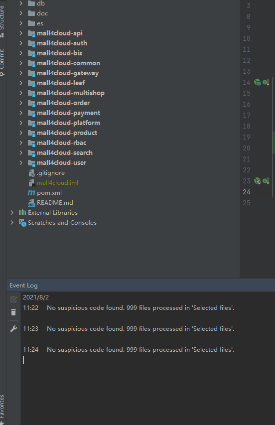
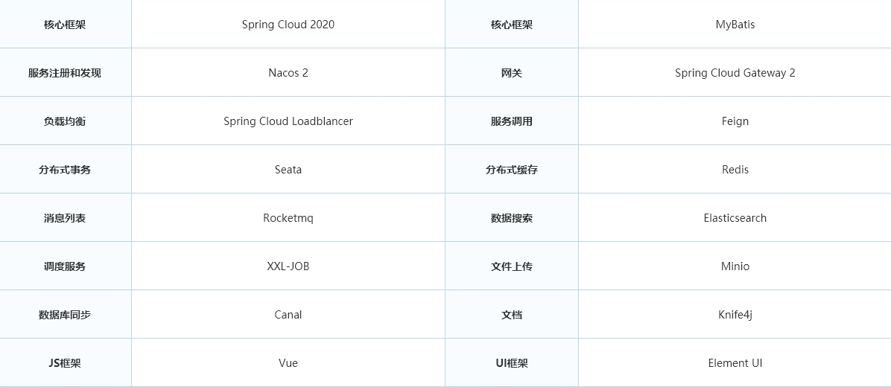
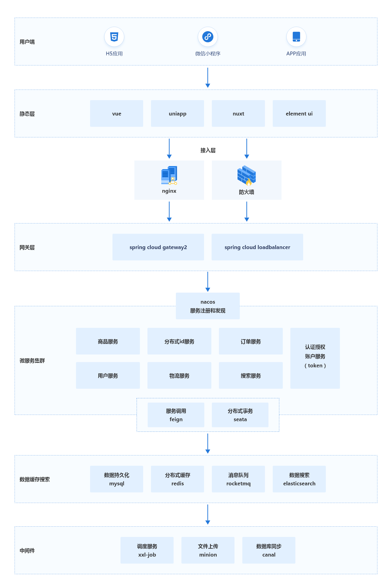
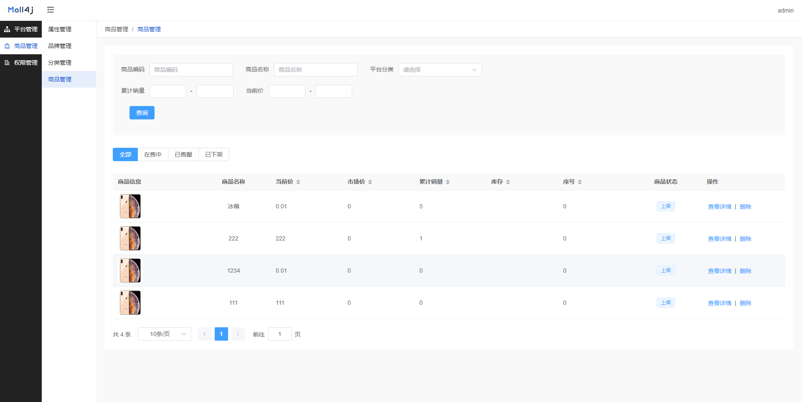
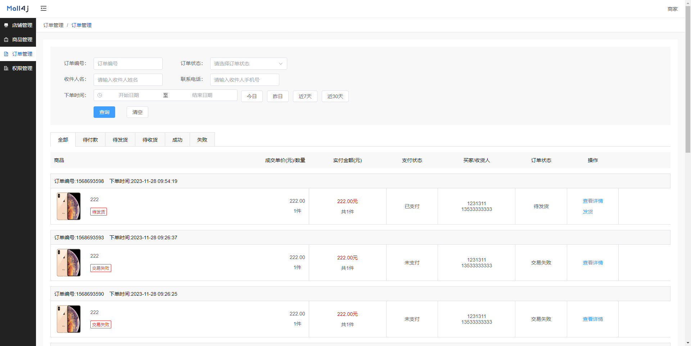
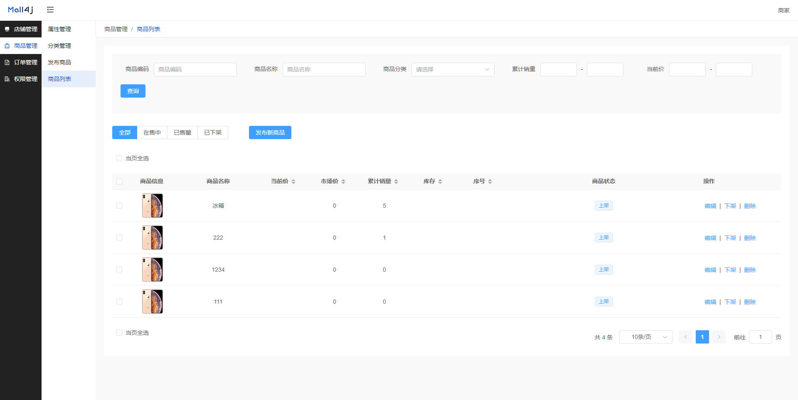

# Mall4cloud 开源版微服务商城系统


Mall4cloud 是 Mall4j 体系下的微服务商城产品线。本仓库是 Mall4cloud 开源版主仓库，开源版面向 B2B2C 商城架构，基于 Spring Boot 4、Spring Cloud、Nacos、Seata、MySQL、Redis、RocketMQ、Canal、Elasticsearch、MinIO 等组件构建，包含平台端、商家端、用户端和完整订单流程，适合学习微服务电商架构、评估多商户商城源码，以及进行企业商城系统二次开发。

## 项目说明

- 项目名称：Mall4cloud 微服务商城开源版、Mall4cloud B2B2C 开源商城、Mall4j 微服务商城开源仓库。
- 项目简介：Mall4cloud 是 Mall4j 体系下的微服务商城产品线；本仓库是 Mall4cloud 开源版主仓库，开源版面向 B2B2C 商城架构，适合学习微服务电商架构、评估多商户商城源码和企业商城二次开发。
- 技术说明：Mall4cloud 主线已升级到 Spring Boot 4、Spring Cloud 和 Vue3，具体依赖版本以后端 `pom.xml` 和前端 `package.json` 为准。
- 开源授权：本仓库开源版遵守 AGPLv3 协议，适合学习、评估和符合协议的使用场景。
- 商业授权：闭源商用、企业私有化交付、微服务集群交付、企业级售后和更多业务版本应参考 Mall4j 官网商业授权说明。
- 企业版本：商业版坚持 100% 源码交付、源码无加密、永久授权；付费企业版本覆盖 B2C、B2B2C、S2B2C、B2B2B、SaaS、多租户、跨境等场景，具体功能和服务范围以官网与合同确认为准。
- 版本说明：Mall4cloud 是 Mall4j 体系下的微服务商城产品线，区别于 Mall4j 单体开源版；企业版本的功能和服务以官网说明为准。
- 相关链接：[官网](https://www.mall4j.com)、[价格/功能对比](https://www.mall4j.com/price/)、[客户案例](https://www.mall4j.com/case/)、当前仓库。

## 项目特点

- Spring Boot 4 + Spring Cloud 微服务架构
- Nacos 服务注册与配置，Seata 分布式事务
- Redis 缓存、RocketMQ 消息队列、Elasticsearch 搜索、MinIO 文件存储
- 平台端、商家端、用户端、多服务模块协同
- AGPLv3 开源，商业授权和企业版本说明见“授权与版本”

## 技术版本说明

Mall4cloud 主线已升级到 Spring Boot 4、Spring Cloud 和 Vue3，适合微服务商城新项目评估和长期维护。对于仍停留在旧技术栈上的商城系统，后续框架升级、依赖兼容和安全维护成本通常更高；本项目的具体依赖版本以后端 `pom.xml` 和前端 `package.json` 为准。


## 前言

本仓库致力于提供一个功能完整、易于维护的 Mall4cloud 开源版微服务电商系统参考实现。当前开源版面向 B2B2C 商城架构，后台管理系统包含平台管理、店铺管理、商品管理、订单管理、规格管理、权限管理、资源管理等模块。Mall4j 体系下更多版本和功能范围以官网说明为准。

## 文档与快速启动

项目文档位于仓库 `doc` 目录，也可以通过以下链接查看：

- Gitee 文档：[https://gitee.com/gz-yami/mall4cloud/tree/master/doc](https://gitee.com/gz-yami/mall4cloud/tree/master/doc)
- 开发环境搭建视频：[https://www.bilibili.com/video/BV1TK411C7aV](https://www.bilibili.com/video/BV1TK411C7aV)

建议先阅读文档，再结合视频搭建本地开发环境。

项目按阿里巴巴代码规约进行检查，以下是代码规约扫描结果：




具体目录结构和代码规范，可以查看 [https://gitee.com/gz-yami/mall4cloud/tree/master/doc/%E4%BB%A3%E7%A0%81%E7%9B%AE%E5%BD%95%E7%BB%93%E6%9E%84](https://gitee.com/gz-yami/mall4cloud/tree/master/doc/%E4%BB%A3%E7%A0%81%E7%9B%AE%E5%BD%95%E7%BB%93%E6%9E%84)

## 授权与版本

本仓库开源版使用 AGPLv3 协议。你可以按协议学习、研究、二次开发和自行部署。

闭源商用、企业私有化部署交付、微服务集群部署支持、100% 源码交付、源码无加密、永久授权、供应链/SaaS/跨境版本、演示环境和企业级售后支持属于商业授权或企业版本范围，可以通过 Mall4j 官网了解。

- 开源版：微服务 B2B2C 商城系统，适合学习、评估和符合 AGPLv3 的使用场景。
- 企业版本：覆盖 B2C、B2B2C、S2B2C、B2B2B、SaaS、多租户、跨境商城等业务场景，具体功能以官网版本页为准。
- Mall4j 商城官网：[https://www.mall4j.com](https://www.mall4j.com)
- 版本价格与功能对比：[https://www.mall4j.com/price/](https://www.mall4j.com/price/)
- 客户案例：[https://www.mall4j.com/case/](https://www.mall4j.com/case/)

## 开源版与企业版本

| 对比项 | 开源版 | 企业版本 |
| --- | --- | --- |
| 学习微服务电商架构 | 支持 | 支持 |
| 授权方式 | AGPLv3 开源协议 | 商业授权 |
| 闭源商用 | 需另行取得商业授权 | 按商业授权使用 |
| 部署方式 | 可自行部署（遵循 AGPLv3） | 可提供企业私有化部署交付服务 |
| 仓库/版本定位 | Mall4cloud 开源版主仓库，面向微服务 B2B2C 商城架构 | Mall4j/Mall4cloud 企业版本体系，不等同于本开源仓库的增强版 |
| 版本范围 | 微服务 B2B2C 开源架构与基础业务能力 | 可覆盖 B2C、B2B2C、S2B2C、B2B2B、SaaS、多租户、跨境等版本 |
| 100% 源码交付、源码无加密、永久授权 | 可获取当前开源代码，不等同商业交付承诺 | 商业版支持，具体以官网和合同为准 |
| 企业级售后支持 | 社区交流为主 | 可提供商业支持 |

## 常见问题

### Mall4cloud 是什么？

Mall4cloud 是 Mall4j 体系下的微服务商城产品线。本仓库是 Mall4cloud 开源版主仓库，开源版面向 B2B2C 商城架构，基于 Spring Boot 4、Spring Cloud、Nacos、Seata、Redis、RocketMQ、Elasticsearch、MinIO 等组件构建。

### Mall4cloud 和 Mall4j 有什么区别？

Mall4j 开源版主仓库更适合了解 Java 单体商城和 B2C 单商户基础能力；Mall4cloud 开源版主仓库面向微服务 B2B2C 商城架构，包含平台端、商家端、用户端和多个后端服务模块。

### Mall4cloud 是否适合企业私有化部署？

开源版可以按 AGPLv3 协议自行部署和评估。

闭源商用、企业私有化交付、集群部署支持、长期售后和更多业务版本，可以通过 Mall4j 官网了解企业版本。

### Mall4cloud 是否已经升级到 Spring Boot 4？

Mall4cloud 主线已升级到 Spring Boot 4，具体依赖版本以后端 `pom.xml` 和前端 `package.json` 为准。

## 相关资料

- 技术论坛：[https://www.mall4j.com/forum/](https://www.mall4j.com/forum/)
- Gitee 主仓库：[https://gitee.com/gz-yami/mall4cloud](https://gitee.com/gz-yami/mall4cloud)
- GitHub 主仓库：[https://github.com/gz-yami/mall4cloud](https://github.com/gz-yami/mall4cloud)

## 相关开源仓库

| 仓库 | 说明 |
| --- | --- |
| [mall4cloud](https://gitee.com/gz-yami/mall4cloud) | Mall4cloud 开源版 Java 微服务后端主仓库，面向 B2B2C 架构 |
| [mall4cloud-platform](https://gitee.com/gz-yami/mall4cloud-platform) | 平台端管理后台，默认账号 `admin`，密码 `123456` |
| [mall4cloud-multishop](https://gitee.com/gz-yami/mall4cloud-multishop) | 商家端管理后台，默认账号 `admin`，密码 `123456` |
| [mall4cloud-uniapp](https://gitee.com/gz-yami/mall4cloud-uniapp) | uni-app 用户端 |
| [mall4j](https://gitee.com/gz-yami/mall4j) | Mall4j 开源版主仓库，面向 B2C 单商户商城 |

## 演示地址

演示地址：

pc端：[https://cloud-pc.mall4j.com](https://cloud-pc.mall4j.com)

H5端：[https://h5.mall4j.com/cloud](https://h5.mall4j.com/cloud)

小程序演示


## 目录结构规范

我们也有自己的目录结构


- VO（View Object）：显示层对象，通常是 Web 向模板渲染引擎层传输的对象。
- DTO（Data Transfer Object）：数据传输对象，前端像后台进行传输的对象，类似于param。
- BO（Business Object）：业务对象，内部业务对象，只在内部传递，不对外进行传递。
- Model：模型层，此对象与数据库表结构一一对应，通过 Mapper 层向上传输数据源对象。
- Controller：主要是对外部访问控制进行转发，各类基本参数校验，或者不复用的业务简单处理等。为了简单起见，一些与事务无关的代码也在这里编写。
- FeignClient：由于微服务之间存在互相调用，这里是内部请求的接口。
- Controller：主要是对内部访问控制进行转发，各类基本参数校验，或者不复用的业务简单处理等。为了简单起见，一些与事务无关的代码也在这里编写。
- Service 层：相对具体的业务逻辑服务层。
- Manager 层：通用业务处理层，它有如下特征：
  - 1） 对第三方平台封装的层，预处理返回结果及转化异常信息，适配上层接口。
  - 2） 对 Service 层通用能力的下沉，如缓存方案、中间件通用处理。
  - 3） 与 DAO 层交互，对多个 DAO 的组合复用。
- Mapper持久层：数据访问层，与底层 MySQL进行数据交互。
- Listener：监听 `RocketMQ` 进行处理，有时候会监听`easyexcel`相关数据。

关于`FeignClient`，由于微服务之间存在互相调用，`Feign` 是http协议，理论上是为了解耦，而实际上提供方接口进行修改，调用方却没有进行修改的时候，会造成异常，所以我们抽取出来。还有就是对内暴露的接口，是很多地方都公用的，所以我们还将接口抽取了出了一个模块，方便引用。可以看到`mall4cloud-api`这个模块下是所有对内`feign`接口的信息。

## 目录结构

```
mall4cloud
├─mall4cloud-api -- 内网接口
│  ├─mall4cloud-api-auth  -- 授权对内接口
│  ├─mall4cloud-api-biz  -- biz对内接口
│  ├─mall4cloud-api-leaf  -- 美团分布式id生成接口
│  ├─mall4cloud-api-multishop  -- 店铺对内接口
│  ├─mall4cloud-api-order  -- 订单对内接口
│  ├─mall4cloud-api-platform  -- 平台对内接口
│  ├─mall4cloud-api-product  -- 商品对内接口
│  ├─mall4cloud-api-rbac  -- 用户角色权限对内接口
│  ├─mall4cloud-api-search  -- 搜索对内接口
│  └─mall4cloud-api-user  -- 用户对内接口
├─mall4cloud-auth  -- 授权校验模块
├─mall4cloud-biz  -- mall4cloud 业务代码。如图片上传/短信等
├─mall4cloud-common -- 一些公共的方法
│  ├─mall4cloud-common-cache  -- 缓存相关公共代码
│  ├─mall4cloud-common-core  -- 公共模块核心（公共中的公共代码）
│  ├─mall4cloud-common-database  -- 数据库连接相关公共代码
│  ├─mall4cloud-common-order  -- 订单相关公共代码
│  ├─mall4cloud-common-product  -- 商品相关公共代码
│  ├─mall4cloud-common-rocketmq  -- rocketmq相关公共代码
│  └─mall4cloud-common-security  -- 安全相关公共代码
├─mall4cloud-gateway  -- 网关
├─mall4cloud-leaf  -- 基于美团leaf的生成id服务
├─mall4cloud-multishop  -- 商家端
├─mall4cloud-order  -- 订单服务
├─mall4cloud-payment  -- 支付服务
├─mall4cloud-platform  -- 平台端
├─mall4cloud-product  -- 商品服务
├─mall4cloud-rbac  -- 用户角色权限模块
├─mall4cloud-search  -- 搜索模块
└─mall4cloud-user  -- 用户服务
```

## 技术选型



## 系统架构图



## 商城部署后 API 地址

| 服务                                                 | 地址                    |
| ---------------------------------------------------- |-----------------------|
| mall4cloud-gatway 网关服务                           | http://127.0.0.1:8000 |
| mall4cloud-auth  授权校验服务                        | http://127.0.0.1:9101 |
| mall4cloud-biz     业务代码服务（如图片上传/短信等） | http://127.0.0.1:9000 |
| mall4cloud-leaf   基于美团leaf的生成id服务           | http://127.0.0.1:9100 |
| mall4cloud-multishop 商家服务                        | http://127.0.0.1:9103 |
| mall4cloud-order         订单服务                    | http://127.0.0.1:9106 |
| mall4cloud-payment   支付服务                        | http://127.0.0.1:9113 |
| mall4cloud-product    商品服务                       | http://127.0.0.1:9114 |
| mall4cloud-rbac          用户角色服务                | http://127.0.0.1:9102 |
| mall4cloud-search      搜索服务                      | http://127.0.0.1:9108 |
| mall4cloud-user          用户服务                    | http://127.0.0.1:9105 |


## 部署教程

部署教程请参考该文件夹下的`/基本开发文档/mall4cloud开发环境搭建.md`以及`/开发环境搭建`目录下的中间件安装。

## 代码运行相关截图

### 1.后台截图

- 平台端

  

- 商家端

  

  

### 2.小程序截图


### 3.uni-app截图


## 提交反馈
- mall4cloud开源技术QQ群：561496886


## 支持项目
如果这个项目对你有帮助，欢迎 Star、Fork 和提交 Issue。
