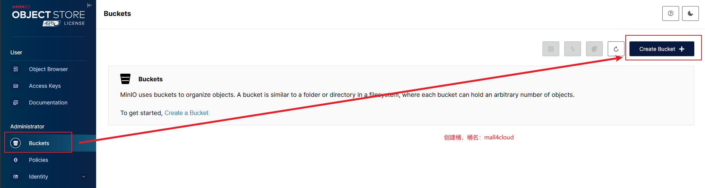

# 中间件 Docker Compose

这个目录保留 Mall4cloud 本地或单机服务器启动中间件所需的 compose 文件和配置材料。它不是通用 Docker 教程；Docker/Compose 安装问题请先查官方文档。

## 先改服务器地址

compose 和初始化 SQL 中仍保留示例地址。启动前请把本目录下的示例 IP 统一替换为你的服务器或本机局域网 IP：

```bash
192.168.1.46 -> <你的服务器IP>
```

需要重点核对的地方：

- `docker-compose.yaml`、`docker-compose-native.yaml` 中的 Nacos、MinIO、Seata、RocketMQ 地址。
- `mysql/initdb/mall4cloud_nacos.sql` 中 Nacos 配置中心写入的 Redis、Seata、OSS、RocketMQ、各服务 MySQL 地址。
- `seata/application.yml` 中的 Seata 数据库地址。
- `canal/conf/example/instance.properties` 中的 MySQL 地址和账号。

## 启动前权限

Linux 服务器上进入本目录后执行：

```bash
chmod -R 777 ./rocketmq
chmod -R 666 ./minio/data
chmod -R 777 ./elasticsearch/data
```

## 启动命令

优先使用带国内镜像地址的 compose：

```bash
docker compose -f docker-compose.yaml up -d --build
```

如果服务器访问 Docker Hub 稳定，也可以使用原生镜像版本：

```bash
docker compose -f docker-compose-native.yaml up -d --build
```

`docker-compose.yaml` 使用处理过的镜像地址，适合国内网络优先尝试。`docker-compose-native.yaml` 使用原生镜像名，只有在服务器 Docker Hub 或镜像源稳定时再使用；不需要重命名文件，直接用 `-f` 指定即可。

首次拉取镜像体积较大，等待时间较长是正常现象。若 RocketMQ 报 `No route info of this topic`，先检查 `rocketmq/broker/conf/broker.conf` 是否成功挂载、`rocketmq/` 目录权限是否足够，再重建 broker/dashboard/namesrv。

## 端口与默认账号

| 中间件 | 端口/地址 | 默认账号 |
| --- | --- | --- |
| MySQL | `<你的服务器IP>:3306` | `root / 80jpnH4.r5g` |
| Redis | `<你的服务器IP>:6379` | 密码 `80jpnH4.r5g` |
| Nacos 控制台 | `http://<你的服务器IP>:8080/index.html` | 本目录初始化 SQL 写入的是 `nacos / 80jpnH4.r5g`，服务配置也必须保持一致 |
| MinIO API | `http://<你的服务器IP>:9000` | 用于后端和前端资源访问 |
| MinIO 控制台 | `http://<你的服务器IP>:9001` | `admin / 80jpnH4.r5g` |
| Elasticsearch | `http://<你的服务器IP>:9200` | `elastic / 80jpnH4.r5g` |
| RocketMQ namesrv | `<你的服务器IP>:9876` | 无控制台账号 |
| RocketMQ dashboard | `http://<你的服务器IP>:8180` | 当前未配置登录保护，生产环境不要裸露 |
| Canal | `<你的服务器IP>:11111` | 由 `canal/conf` 配置 |
| Seata | `<你的服务器IP>:8091` | Seata 2.6 只使用 8091 |

## MinIO 桶

进入 MinIO 控制台后创建桶：

```text
mall4cloud
```

端口用途：

- `9000`：对象访问和上传地址，Nacos 的 `biz.oss.endpoint`、前端 `VITE_APP_RESOURCES_URL` 都应指向这里。
- `9001`：控制台地址，只给运维人员使用。

如果前端图片无法展示，先检查桶是否存在、桶策略是否允许读取、Nacos 中 `biz.oss.resources-url` 是否是 `http://<你的服务器IP>:9000/mall4cloud`。

参考截图：

## Elasticsearch 索引

搜索服务依赖 `product` 和 `order` 两类索引。mapping 以仓库根目录为准：

- [product mapping](../../../es/product.md)
- [order mapping](../../../es/order.md)

创建索引时用 Elasticsearch 账号 `elastic / 80jpnH4.r5g`。下面截图只作为操作界面参考：

- 
- 

## Nacos、Canal、Seata

初始化配置在 `mysql/initdb` 下：

- `mall4cloud_nacos.sql`：写入 Nacos 配置中心，包含网关路由、数据源、Redis、OSS、RocketMQ、Seata 地址。
- `mall4cloud_seata.sql`：Seata 事务表。
- Canal 相关配置保留在 `canal/conf`。

Nacos v3 控制台走 `8080`，服务客户端配置仍使用 `8848`，Nacos 2/3 客户端还会用到 `9848`、`9849`。防火墙或安全组只放开控制台端口时，Java 服务仍可能连不上。

Seata 2.6 本目录的 compose 只暴露 `8091`。如果需要控制台能力，请按 Seata 官方方式单独部署，不要在 `seata/application.yml` 中添加未验证的 console 配置。

## 验收

- `docker ps` 能看到 MySQL、Redis、Nacos、Seata、ES、Canal、RocketMQ、MinIO 容器运行。
- Nacos 控制台能登录，并能看到 `application.yml`、`mall4cloud-gateway.yml` 等配置。
- MySQL 中存在 `mall4cloud_auth`、`mall4cloud_rbac`、`mall4cloud_product`、`mall4cloud_order` 等库。
- MinIO 存在 `mall4cloud` 桶。
- RocketMQ dashboard 能看到 namesrv。

如果这些都通过，再回到 [环境搭建/后端启动](../../2-环境搭建/3-后端启动.md)。
