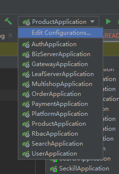
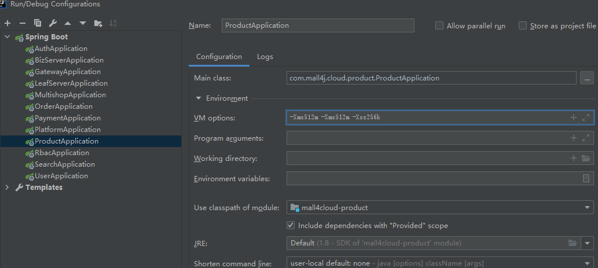
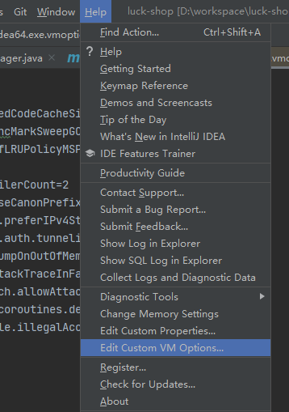
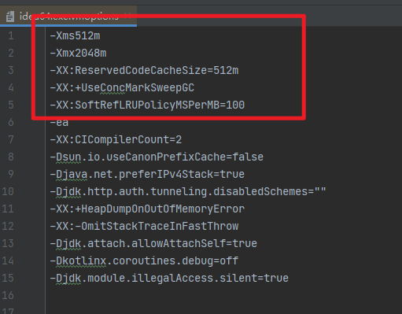
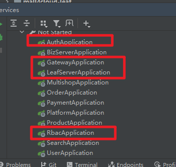

## 1. 中间件安装

本项目是一个分布式的项目，依赖较多的中间件，所以要先将中间件搭建起来才能够启动后台项目。

中间件安装参考`./中间件docker-compse一键安装/README.md` 这篇文章

## 2. 导入项目

### 2.1 安装jdk + maven + git

使用git下载项目


使用idea，点击open，打开下载好的目录


使用`ctrl + shift + r` 全局替换掉 `192.168.1.46` 为中间件服务器ip

## 3. 设置idea内存

在idea启动所有的项目，是很吃力的事情。所以要修改下idea的配置，让其能有足够的内存启动项目

### 3.1 减小jar启动占用内存

编辑虚拟机配置，将每个服务的内存改为512M，`-Xms512m -Xmx512m -Xss256k`,如果机器实在内存不够，可以将512适当减少，但是减少到一定程度，如256m会造成java虚拟机频繁的垃圾回收，会更加卡，所以推荐512m。





### 3.2 增加idea可使用内存

编辑idea配置，增加内存，至少变为2G，根据需要，可以适当增大，以提高流畅度。

```vmoptions
-Xms512m
-Xmx2048m
-XX:ReservedCodeCacheSize=512m
-XX:+UseConcMarkSweepGC
-XX:SoftRefLRUPolicyMSPerMB=100
```





配置完毕，重启idea，此时可以启动所有项目。

## 4. 启动项目



框框中的是必须启动的项目，其他是按需启动，推荐全部都启动起来，需要一台16G内存以上的电脑

