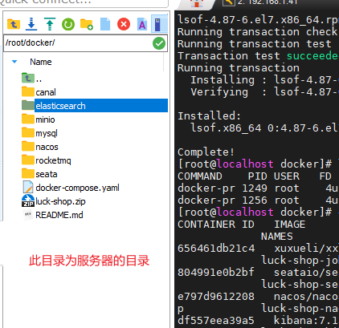
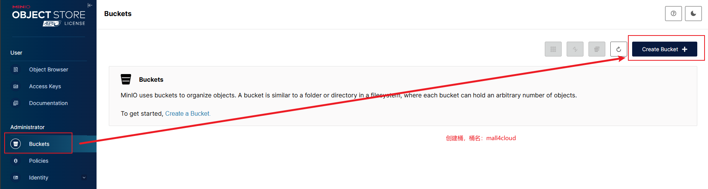
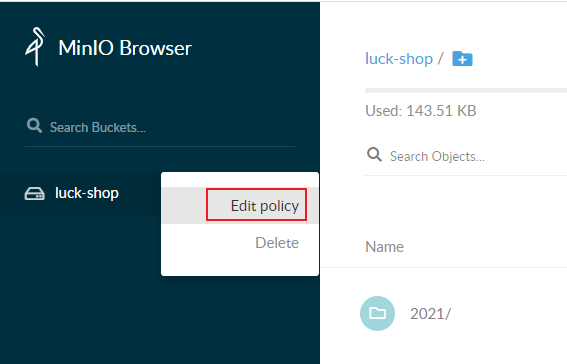
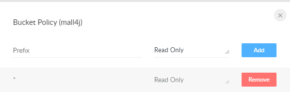

> 如果不清楚如何安装docker-compose的，可以看下《centos安装docker》文档

1.在文件编辑器上，使用全局替换的方式，将文件夹下的所有 `192.168.1.46`替换为服务器的ip

2.将本目录所有文件及文件夹打包上传到服务器，效果如图所示



3.执行授权命令

```
chmod -R 777 ./rocketmq
chmod -R 666 ./minio/data
chmod -R 777 ./elasticsearch/data
```

4.启动容器

> ps: 容器一共要下载7G左右的数据，请耐心等待

```
docker compose up -d --build
```


5.各个端访问路径及其密码

请自行192.168.1.46替换为服务器ip

 - mysql: 使用数据库连接工具进行连接， 端口3306 账号及密码 root/80jpnH4.r5g
 - minio: http://192.168.1.46:9000 账号及密码 admin/80jpnH4.r5g
 - redis: 端口6379，密码为80jpnH4.r5g
 - nacos: http://192.168.1.46:8848/nacos 账号及密码 nacos/nacos 请自行修改密码，确保不被攻击
 - rocketmq-dashboard：http://192.168.1.46:8180 未配置密码，请自行配置


6.访问minio管理页面，创建存储区域(Create Bucker) 名为`mall4cloud`



若要前端可以读取图片，需要设置权限





7.创建es索引

新建索引

根据自己本地ip地址打开post，设置es的用户名密码如下界面


需创建`order`、`product`两个索引

复制下述命令到左框，点击执行后即可

命令的内容参考本目录下`../es/order.md` `../es/product.md`


