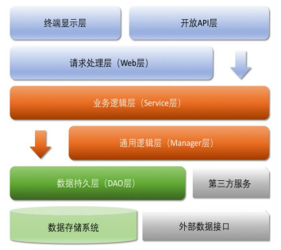
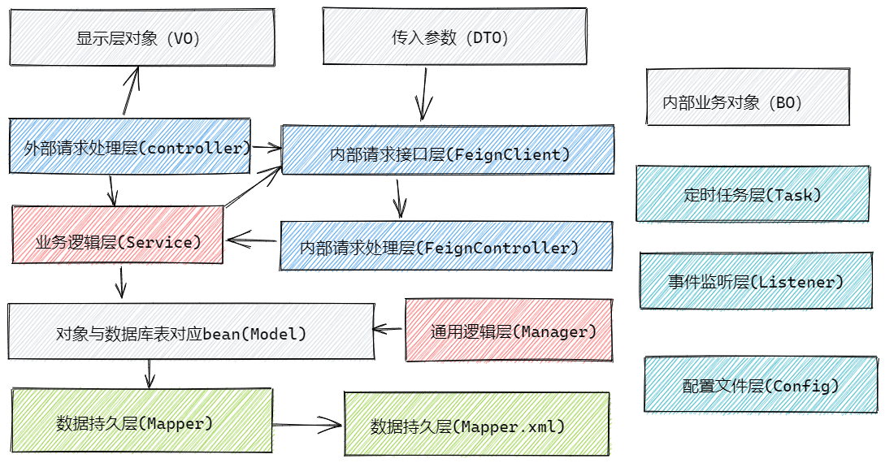

> 为了让项目更加方便检测出代码规范的问题，我们在项目中使用的是阿里的规范（详细可以看https://github.com/alibaba/p3c 这里面的[Java开发手册（嵩山版）.pdf](https://github.com/alibaba/p3c/blob/master/Java开发手册（嵩山版）.pdf)），同时使用 `Alibaba Java Coding Guidelines` 这款插件进行规约扫描


我们先来看下规范当中的目录结构



- 开放 API 层：可直接封装 Service 接口暴露成 RPC 接口；通过 Web 封装成 http 接口；网关控制层等。
- 终端显示层：各个端的模板渲染并执行显示的层。当前主要是 velocity 渲染，JS 渲染，JSP 渲染，移 动端展示等。 
- Web 层：主要是对访问控制进行转发，各类基本参数校验，或者不复用的业务简单处理等。
- Service 层：相对具体的业务逻辑服务层。 
- Manager 层：通用业务处理层，它有如下特征：
  -  1） 对第三方平台封装的层，预处理返回结果及转化异常信息，适配上层接口。
  -  2） 对 Service 层通用能力的下沉，如缓存方案、中间件通用处理。
  -  3） 与 DAO 层交互，对多个 DAO 的组合复用。
- DAO 层：数据访问层，与底层 MySQL、Oracle、Hbase、OB 等进行数据交互。 
- 第三方服务：包括其它部门 RPC 服务接口，基础平台，其它公司的 HTTP 接口，如淘宝开放平台、支 付宝付款服务、高德地图服务等。 
- 外部数据接口：外部（应用）数据存储服务提供的接口，多见于数据迁移场景中。


------

以上是阿里规范当中的目录结构，我们也有自己的目录结构



- VO（View Object）：显示层对象，通常是 Web 向模板渲染引擎层传输的对象。
- DTO（Data Transfer Object）：数据传输对象，前端像后台进行传输的对象，类似于param。
- BO（Business Object）：业务对象，内部业务对象，只在内部传递，不对外进行传递。
- Model：模型层，此对象与数据库表结构一一对应，通过 Mapper 层向上传输数据源对象。
- Controller：主要是对外部访问控制进行转发，各类基本参数校验，或者不复用的业务简单处理等。为了简单起见，一些与事务无关的代码也在这里编写。
- FeignClient：由于微服务之间存在互相调用，这里是内部请求的接口。
- Controller：主要是对内部访问控制进行转发，各类基本参数校验，或者不复用的业务简单处理等。为了简单起见，一些与事务无关的代码也在这里编写。
- Service 层：相对具体的业务逻辑服务层。 
- Manager 层：通用业务处理层，它有如下特征：
  -  1） 对第三方平台封装的层，预处理返回结果及转化异常信息，适配上层接口。
  -  2） 对 Service 层通用能力的下沉，如缓存方案、中间件通用处理。
  -  3） 与 DAO 层交互，对多个 DAO 的组合复用。
- Mapper持久层：数据访问层，与底层 MySQL进行数据交互。 
- Task层：由于每个服务之间会存在定时任务，比如定时确认收货，定时将活动失效等情况，这里面的Task实际上连接的是`xxl-job`（具体可以查看 https://github.com/xuxueli/xxl-job ）进行任务调度。
- Listener：监听 `RocketMQ` 进行处理，有时候会监听`easyexcel`相关数据。


关于`FeignClient`，由于微服务之间存在互相调用，`Feign` 是http协议，理论上是为了解耦，而实际上提供方接口进行修改，调用方却没有进行修改的时候，会造成异常，所以我们抽取出来。还有就是对内暴露的接口，是很多地方都公用的，所以我们还将接口抽取了出了一个模块，方便引用。可以看到`mall4cloud-api`这个模块下是所有对内`feign`接口的信息。


## 目录结构

```
mall4cloud
├─mall4cloud-api -- 内网接口
│  ├─mall4cloud-api-auth  -- 授权对内接口
│  ├─mall4cloud-api-biz  -- biz对内接口
│  ├─mall4cloud-api-leaf  -- 美团分布式id生成接口
│  ├─mall4cloud-api-multishop  -- 店铺对内接口
│  ├─mall4cloud-api-order  -- 订单对内接口
│  ├─mall4cloud-api-platform  -- 平台对内接口
│  ├─mall4cloud-api-product  -- 商品对内接口
│  ├─mall4cloud-api-rbac  -- 用户角色权限对内接口
│  ├─mall4cloud-api-search  -- 搜索对内接口
│  └─mall4cloud-api-user  -- 用户对内接口
├─mall4cloud-auth  -- 授权校验模块
├─mall4cloud-biz  -- mall4cloud 业务代码。如图片上传/短信等
├─mall4cloud-common -- 一些公共的方法
│  ├─mall4cloud-common-cache  -- 缓存相关公共代码
│  ├─mall4cloud-common-core  -- 公共模块核心（公共中的公共代码）
│  ├─mall4cloud-common-database  -- 数据库连接相关公共代码
│  ├─mall4cloud-common-order  -- 订单相关公共代码
│  ├─mall4cloud-common-product  -- 商品相关公共代码
│  ├─mall4cloud-common-rocketmq  -- rocketmq相关公共代码
│  └─mall4cloud-common-security  -- 安全相关公共代码
├─mall4cloud-gateway  -- 网关
├─mall4cloud-leaf  -- 基于美团leaf的生成id服务
├─mall4cloud-multishop  -- 商家端
├─mall4cloud-order  -- 订单服务
├─mall4cloud-payment  -- 支付服务
├─mall4cloud-platform  -- 平台端
├─mall4cloud-product  -- 商品服务
├─mall4cloud-rbac  -- 用户角色权限模块
├─mall4cloud-search  -- 搜索模块
└─mall4cloud-user  -- 用户服务
```
