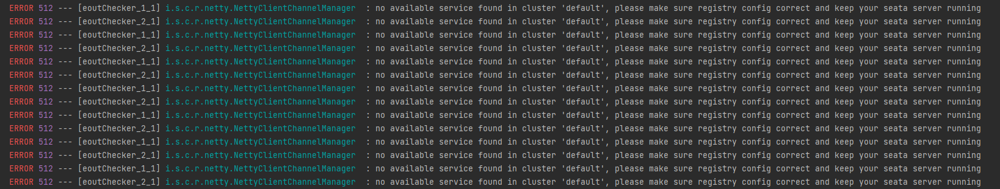
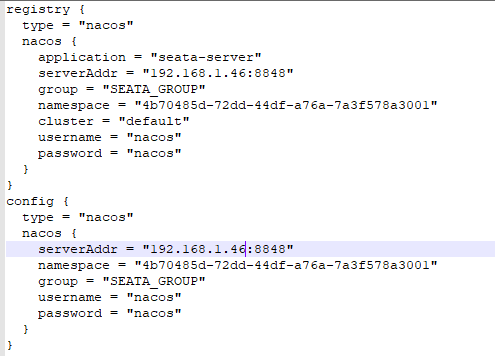

## 一、创建更新商品后，列表数据错误

- 成功发布商品后商品列表没有看到新发布的商品

- 成功修改了商品的信息，但列表中显示的数据还是旧的

### 以上问题基本是由以下配置错误引起的

#### 1.canal没有读取到mysql的binlog

mysql查询binglog位置

```mysql
SHOW MASTER STATUS
```

编辑`./canal/conf/example/instance.properties`

修改以下四个参数

```properties
# 填写数据库地址
canal.instance.master.address=192.168.1.46:3306
# 填写mysql执行命令`SHOW MASTER STATUS`后的File内容
canal.instance.master.journal.name=mysql-binlog.000001


# username/password
# 填写数据库账号
canal.instance.dbUsername=canal
# 填写数据库密码
canal.instance.dbPassword=canal
```

#### 2.canal没有连接上RocketMQ

根据 `./canal/logs/example` 中的  `example.log` 判断无法连接mq


编辑`./canal/conf/canal.properties`


```properties
# 填写RocketMQ地址
rocketmq.namesrv.addr = 192.168.1.41:9876
```


重启`canal`

```shell
docker restart mall4cloud-canal
```


重启`canal`

```shell
docker restart mall4cloud-canal
```


#### 3. 其他错误
大部分错误可以根据 `./canal/logs/example` 中  `example.log`  的报错信息查找到解决方案

但修改配置后要记得重启对应的容器，使配置生效


## seata常见配置问题处理



#### 1.nacos账号密码、地址或命名空间错误

######  seata的配置文件放置在 `中间件docker-compse一键安装\seata` 文件下



