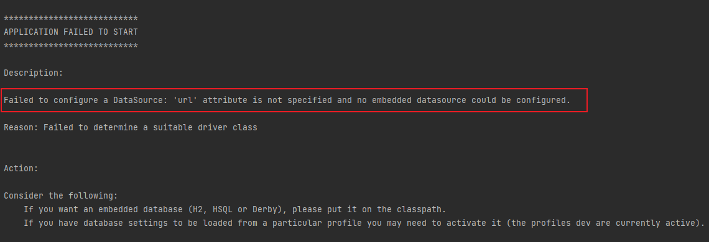

## 服务启动时常见的nacos问题

错误一：

## 排查步骤：
### 一、naocs是否启动成功

nacos部署的服务器上，执行 `docker ps -a` 找到nacos容器的状态，如果不再启动状体或者一直重启，
则通过 `docker logs -f mall4cloud-nacos` 查看nacos的运行日志，根据错误信息将配置更改正确即可。

例： 错误信息为mysql连接超时，则修改`docker-compose.yaml`中的nacos容器的mysql地址和账号等，
或者查看mysql账号是否开启访问权限（本地访问、远程访问）

`nacos`启动成功后能通过`ip:8848/nacos`访问后台控制页面，所以也可以根据访问`nacos`后台控制页面来判断是否启动成功。

### 二、nacos连接配置

例1： 服务启动时`nacos`连接失败， 修改更正`bootstarp.yml` 文件中的`nacos`地址、端口、账号密码

例2： `nacos`可以连接，且其中的中间件信息配置，但服务日志中的中间件地址和nacos上配置的地址无法对应上，
比如`nacos`上配置的redis地址是：`192.168.1.46`, 但服务启动日志中redis连接超时，且地址为`127.0.01`

步骤：
- 端口没有开放（8848、9848）， 浏览器中通过`ip:8848/nacos`可以访问nacos页面代表8848已经开放
- `nacos`配置列表中没有服务配置信息，重新导入`mall4cloud-nacos.sql`, 导入`mall4cloud-nacos`成功后，重启`nacos`容器
- `nacos`配置列表中有服务配置项，错误场景为例2，配置的信息和服务启动日志中有差异，重启`nacos`容器（缓存导致）
