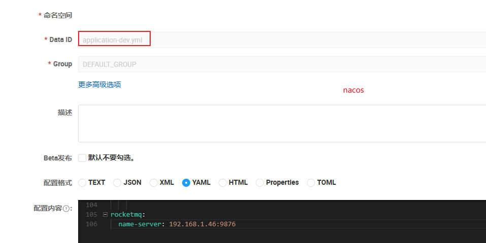

## 一、配置

### 1. 确认rocketmq地址

nacos的`application-dev.yml`配置文件中，找到rocketmq的配置，并与服务日志中的rocketmq地址对比，确保一致
如果不一致，基本都是nacos缓存导致服务读取的配置并不是最新配置， 重启nacos后，再重启所有java服务

需要在seata容器启动之前更改完成，填写正确的MySQL地址、账号和密码。如果容器启动之后再更改配置文件，则重启下容器。

