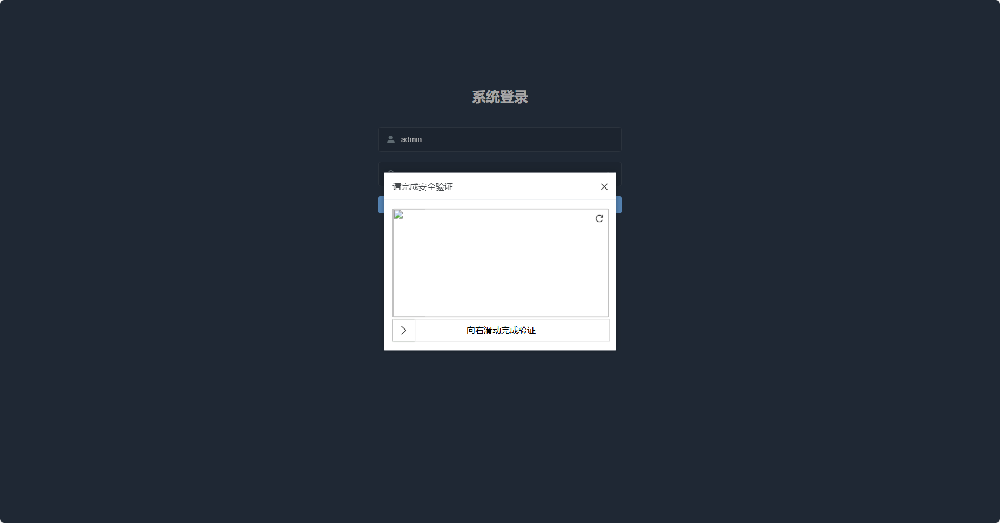
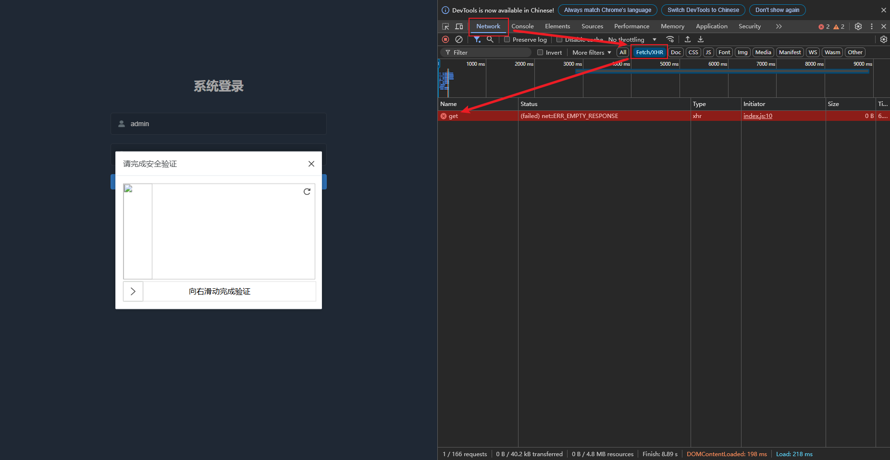
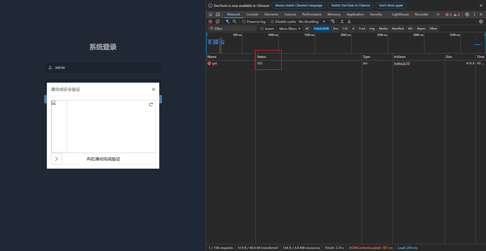
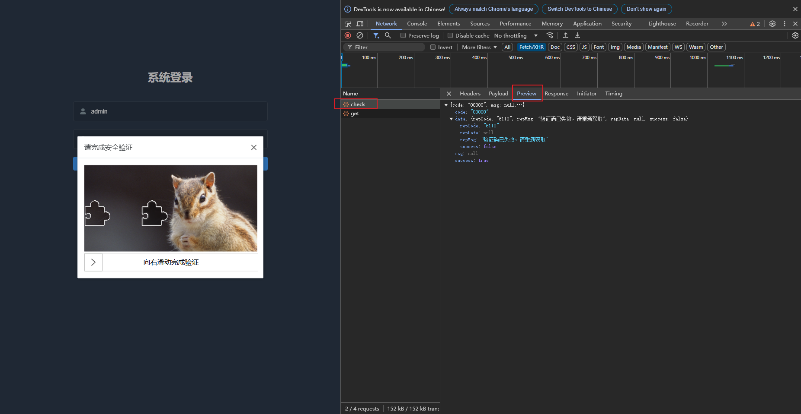
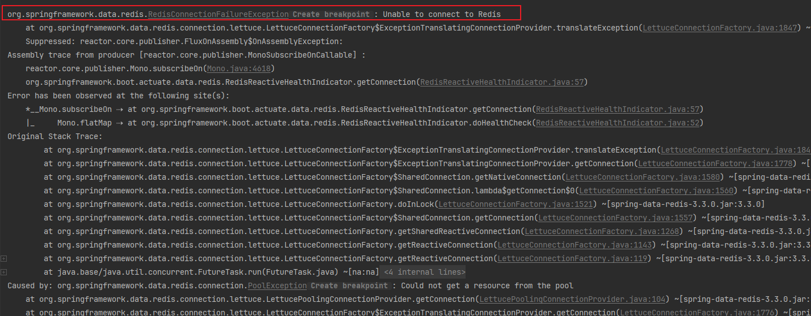

# 一. `滑动验证码`加载失败

异常排查操作：

- F12打开空值台
- 切换到到Network
- 过滤请求Fetch/XHR
- 查看滑动验证码的接口请求信息

### 1. 出现下图中的异常

排查：检查接口是否启动，或者接口路径是否正确

### 2. HTTP状态码为`503`

排查：是否没有启动所有的java服务

### 3. 验证码正常加载，但一直无法通过验证

#### 排查

##### Redis配置错误或者Redis没有启动

排查步骤一：检查Redis启动状态，最好确定下能不能正常连接

排查步骤二：登录`Nacos`控制台页面，查看`application-dev.yml`中的Redis配置，检查Redis配置的ip、端口、密码， 如果没有更改Redis端口就不需要配置（默认端口是6379）
