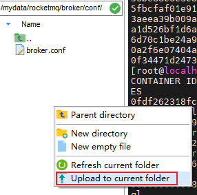
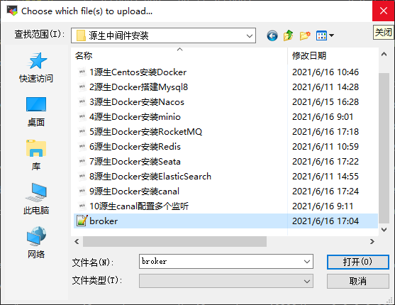
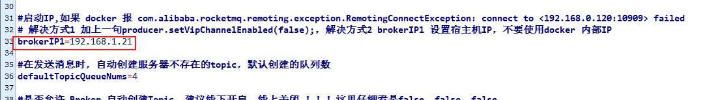
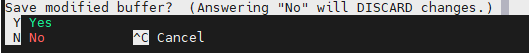
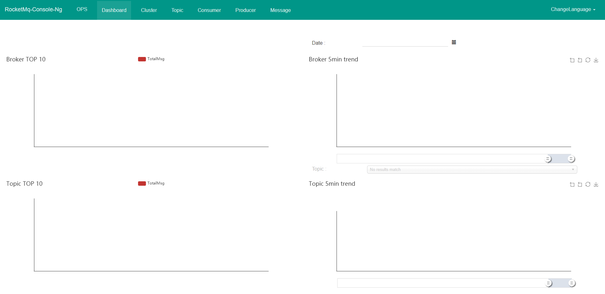

### Docker安装rocketMQ

1、docker拉取最新镜像

```shell
docker pull foxiswho/rocketmq:4.8.0
docker pull styletang/rocketmq-console-ng
```

创建文件夹

```shell
mkdir -p /mydata/rocketmq/namesrv/logs && \
mkdir -p /mydata/rocketmq/namesrv/store && \
mkdir -p /mydata/rocketmq/broker/logs && \
mkdir -p /mydata/rocketmq/broker/store && \
mkdir -p /mydata/rocketmq/broker/conf

# 设置为 777 权限，否则映射不生效
chmod 777 /mydata/rocketmq/namesrv/logs && \
chmod 777 /mydata/rocketmq/namesrv/store && \
chmod 777 /mydata/rocketmq/broker/logs && \
chmod 777 /mydata/rocketmq/broker/store && \
chmod 777 /mydata/rocketmq/broker/conf
```

将文件夹中"**broker.conf**"复制到**/mydata/rocketmq/broker/conf/broker.conf**






#### 注意:

如果你的微服务或者项目在开发的时候没有放入docker中或者与rocketmq容器不能直接用IP访问,那么需要把**/mydata/rocketmq/broker/conf/broker.conf** 配置文件中的brokerIP1=192.168.1.21 这个启用，IP 地址填 你docker 所在宿主机的IP，否则报错。



2、编写docker-compose

```shell
mkdir ~/docker-build
#若显示文件已存在，则进行下一步cd
cd ~/docker-build
nano docker-compose.yml
```

```shell
version: '3.5'

services:
  rocketmq-namesrv:
    image: foxiswho/rocketmq:4.8.0
    container_name: rocketmq-namesrv
    ports:
      - 9876:9876
    volumes:
      - /mydata/rocketmq/namesrv/logs:/home/rocketmq/logs
      - /mydata/rocketmq/namesrv/store:/home/rocketmq/store
    environment:
      JAVA_OPT_EXT: "-Duser.home=/home/rocketmq -Xms512M -Xmx512M -Xmn128m"
    command: ["sh","mqnamesrv"]
    networks:
        rocketmq:
          aliases:
            - rocketmq-namesrv
  rocketmq-broker:
    image: foxiswho/rocketmq:4.8.0
    container_name: rocketmq-broker
    ports:
      - 10909:10909
      - 10911:10911
    volumes:
      - /mydata/rocketmq/broker/logs:/home/rocketmq/logs
      - /mydata/rocketmq/broker/store:/home/rocketmq/store
      - /mydata/rocketmq/broker/conf/broker.conf:/etc/rocketmq/broker.conf
    environment:
        JAVA_OPT_EXT: "-Duser.home=/home/rocketmq -Xms512M -Xmx512M -Xmn128m"
    command: ["sh","mqbroker","-c","/etc/rocketmq/broker.conf","-n","rocketmq-namesrv:9876","autoCreateTopicEnable=true"]
    depends_on:
      - rocketmq-namesrv
    networks:
      rocketmq:
        aliases:
          - rocketmq-broker

  rocketmq-console:
    image: styletang/rocketmq-console-ng
    container_name: rocketmq-console
    ports:
      - 8180:8080
    environment:
        JAVA_OPTS: "-Drocketmq.namesrv.addr=rocketmq-namesrv:9876 -Dcom.rocketmq.sendMessageWithVIPChannel=false"
    depends_on:
      - rocketmq-namesrv
    networks:
      rocketmq:
        aliases:
          - rocketmq-console

networks:
  rocketmq:
    name: rocketmq
    driver: bridge
```

ctrl+X退出编辑，而后输入"Y",再按下回车即可保存编辑。



3.启动

```shell
docker-compose up -d
#如出现"-bash: docker-compose: command not found"，请参考文件"源生Centos安装Docker"中的安装docker-compose再执行此命令
```

4. 访问浏览器:

```shell
localhost:8180
```



