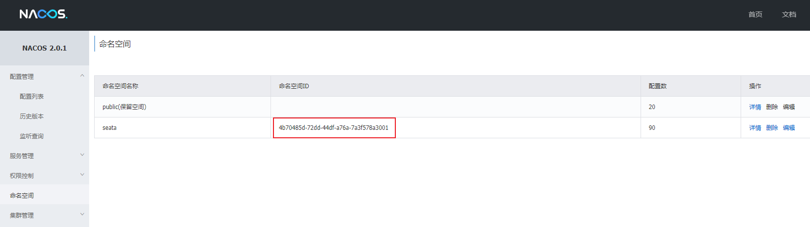
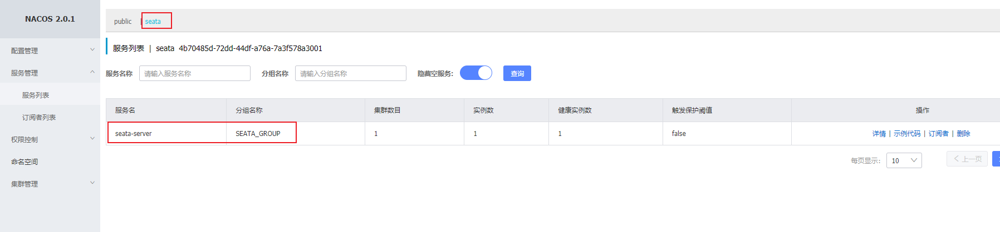
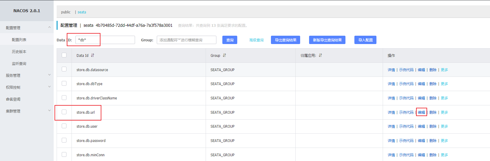
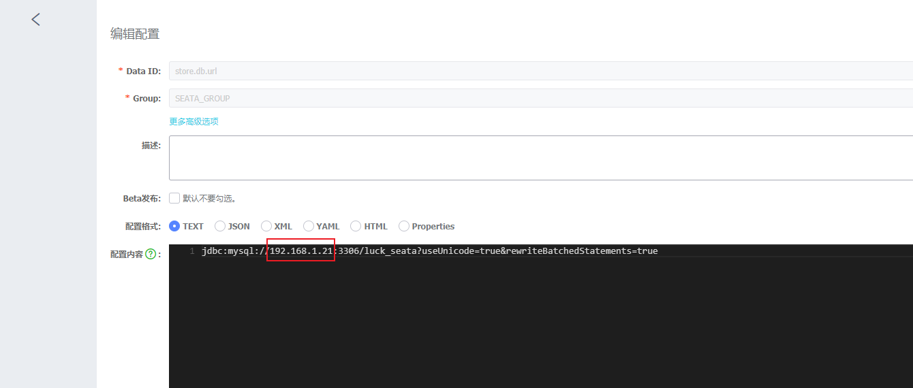

### Docker安装Seata

安装seata前，需要使用docker安装好nacos配置中心，参考文件"**Docker安装Nacos**"。

```shell
#docker拉取指定版本的seata
docker pull seataio/seata-server:1.4.2
#启动
docker run --name seata-server -p 8091:8091 -d  seataio/seata-server:1.4.2
#将配置文件复制到指定文件夹，方便修改配置
docker cp seata-server:/seata-server /opt/seata-config/
#停止seata运行
docker stop seata-server
#删除
docker rm seata-server
#修改配置文件registry
vi /opt/seata-config/resources/registry.conf
```

配置文件中**serverAddr修改为自己的ip地址**，namespace参考nacos中的命名空间，如下：



```shell
registry {
  type = "nacos"
  nacos {
    application = "seata-server"
    serverAddr = "localhost:8848"
    group = "SEATA_GROUP"
    namespace = "4b70485d-72dd-44df-a76a-7a3f578a3001"
    cluster = "default"
    username = "nacos"
    password = "nacos"
  }
}
config {
  type = "nacos"
  nacos {
    serverAddr = "localhost:8848"
    namespace = "4b70485d-72dd-44df-a76a-7a3f578a3001"
    group = "SEATA_GROUP"
    username = "nacos"
    password = "nacos"
  }
}
```

启动seata。

```shell
docker run --name seata-server -d \
        -p 8091:8091 \
        -e SEATA_IP=192.168.1.21 \
        -e SEATA_CONFIG_NAME=file:/root/seata-config/registry \
        -v /opt/seata-config/resources:/root/seata-config  \
        seataio/seata-server:1.4.2
```

nacos中出现以下服务即安装成功。

**修改配置内容**



