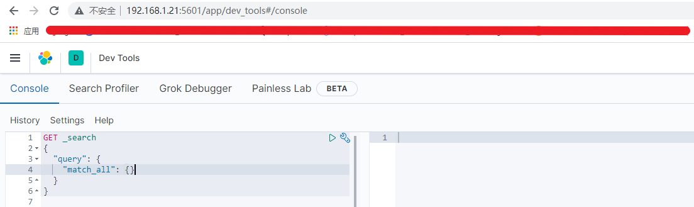
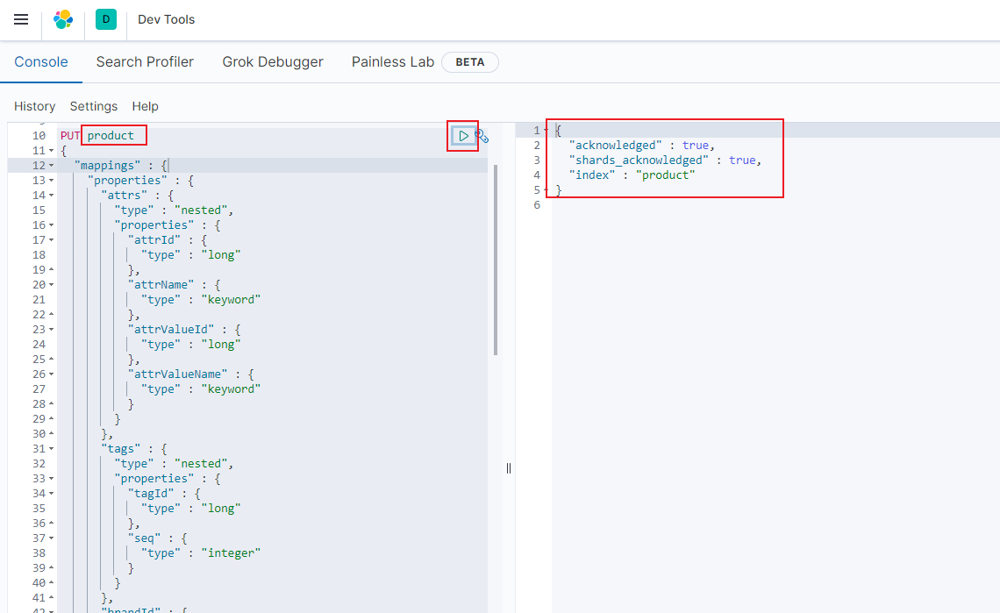

### Docker安装ElasticSearch

### 1、安装elasticsearch

（1）下载elasticsearch和kibana

```shell
docker pull elasticsearch:7.9.1
docker pull kibana:7.9.1
```

（2）配置

```shell
mkdir -p /mydata/elasticsearch/config
mkdir -p /mydata/elasticsearch/data
echo "http.host: 0.0.0.0" >/mydata/elasticsearch/config/elasticsearch.yml
# 设置为 777 权限
chmod -R 777 /mydata/elasticsearch/
```

（3）启动Elastic search

```shell
docker run --name elasticsearch --restart=always -p 9200:9200 -p 9300:9300 \
-e  "discovery.type=single-node" \
-e ES_JAVA_OPTS="-Xms512m -Xmx512m" \
-v /mydata/elasticsearch/config/elasticsearch.yml:/usr/share/elasticsearch/config/elasticsearch.yml \
-v /mydata/elasticsearch/data:/usr/share/elasticsearch/data \
-v  /mydata/elasticsearch/plugins:/usr/share/elasticsearch/plugins \
-d elasticsearch:7.9.1
```

（4）启动kibana：

```shell
docker run --name kibana --restart=always --link elasticsearch:elasticsearch -p 5601:5601 -d kibana:7.9.1
```

### 2、安装IK

IK项目地址：https://github.com/medcl/elasticsearch-analysis-ik

首先需要说明的是，IK插件必须和 ElasticSearch 的版本一致，否则不兼容。

本系统采用的ElasticSearch版本为7.9.1

#### 安装

- 方法1：在线安装

  ```shell
  #进入容器
  docker exec -it elasticsearch /bin/bash
  
  #下载
  elasticsearch-plugin install https://github.com/medcl/elasticsearch-analysis-ik/releases/download/v7.9.1/elasticsearch-analysis-ik-7.9.1.zip
  
  #退出并重新启动ElasticSearch
  exit
  docker restart elasticsearch
  ```

- 方法2：离线安装

  从 https://github.com/medcl/elasticsearch-analysis-ik/releases 下载压缩包，然后在ES的plugins目录创建analysis-ik子目录，把压缩包的内容复制到这个目录里面即可。最终plugins/analysis-ik/目录里面的内容：

  plugins/analysis-ik/
      commons-codec-1.9.jar
      commons-logging-1.2.jar
      elasticsearch-analysis-ik-6.2.4.jar
      httpclient-4.5.2.jar
      httpcore-4.4.4.jar
      plugin-descriptor.properties
  然后重启 ElasticSearch。

  可参考https://www.cnblogs.com/szwdun/p/10664348.html

### 3、新建索引

根据自己本地ip地址打开控制台，如下界面

http://localhost:5601/app/dev_tools#/console



需创建`order`、`product`两个索引

复制下述命令到左框，点击执行后即可

```json
PUT product
{
  "mappings" : {
    "properties" : {
      "attrs" : {
        "type" : "nested",
        "properties" : {
          "attrId" : {
            "type" : "long"
          },
          "attrName" : {
            "type" : "keyword"
          },
          "attrValueId" : {
            "type" : "long"
          },
          "attrValueName" : {
            "type" : "keyword"
          }
        }
      },
      "tags" : {
        "type" : "nested",
        "properties" : {
          "tagId" : {
            "type" : "long"
          },
          "seq" : {
            "type" : "integer"
          }
        }
      },
      "brandId" : {
        "type" : "long"
      },
      "brandImg" : {
        "type" : "keyword"
      },
      "brandName" : {
        "type" : "keyword"
      },
      "code" : {
        "type" : "text",
        "fields" : {
          "keyword" : {
            "type" : "keyword",
            "ignore_above" : 256
          }
        }
      },
      "commentNum" : {
        "type" : "integer"
      },
      "createTime" : {
        "type" : "date"
      },
      "hasStock" : {
        "type" : "boolean"
      },
      "imgUrls" : {
        "type" : "keyword",
        "index" : false,
        "doc_values" : false
      },
      "mainImgUrl" : {
        "type" : "text",
        "fields" : {
          "keyword" : {
            "type" : "keyword",
            "ignore_above" : 256
          }
        }
      },
      "marketPriceFee" : {
        "type" : "long"
      },
      "priceFee" : {
        "type" : "long"
      },
      "saleNum" : {
        "type" : "integer"
      },
      "sellingPoint" : {
        "type" : "text",
        "analyzer" : "ik_max_word",
        "search_analyzer" : "ik_smart"
      },
      "shopId" : {
        "type" : "long"
      },
      "shopImg" : {
        "type" : "keyword",
        "index" : false,
        "doc_values" : false
      },
      "shopName" : {
        "type" : "text",
        "analyzer" : "ik_max_word",
        "search_analyzer" : "ik_smart"
      },
      "shopType" : {
        "type" : "integer"
      },
      "shopPrimaryCategoryId" : {
        "type" : "long"
      },
      "shopPrimaryCategoryName" : {
        "type" : "keyword"
      },
      "shopSecondaryCategoryId" : {
        "type" : "long"
      },
      "shopSecondaryCategoryName" : {
        "type" : "keyword"
      },
      "primaryCategoryId" : {
        "type" : "long"
      },
      "primaryCategoryName" : {
        "type" : "keyword"
      },
      "secondaryCategoryId" : {
        "type" : "long"
      },
      "secondaryCategoryName" : {
        "type" : "keyword"
      },
      "categoryId" : {
        "type" : "long"
      },
      "categoryName" : {
        "type" : "keyword"
      },
      "spuId" : {
        "type" : "long"
      },
      "spuName" : {
        "type" : "text",
        "analyzer" : "ik_max_word",
        "search_analyzer" : "ik_smart"
      },
      "spuStatus" : {
        "type" : "integer"
      },
      "success" : {
        "type" : "boolean"
      }
    }
  }
}
```



参照如上，创建`order`索引

```json
PUT order
{
  "mappings": {
    "properties": {
      "orderId": {
        "type": "long"
      },
      "createTime": {
        "type": "date" 
      },
      "shopName": {
        "type": "text",
        "analyzer": "ik_max_word",
        "search_analyzer": "ik_smart"
      },
      "shopId": {
        "type": "long"
      },
      "userId": {
        "type": "long"
      },
      "consignee": {
        "type": "text"
      },
      "mobile": {
        "type": "text"
      },
      "status": {
        "type": "integer"
      },
      "deliveryType": {
        "type": "integer"
      },
      "total": {
        "type": "long"
      },
      "closeType": {
        "type": "integer"
      },
      "payTime": {
        "type": "date"
      },
      "deliveryTime": {
        "type": "date"
      },
      "finallyTime": {
        "type": "date"
      },
      "cancelTime": {
        "type": "date"
      },
      "isPayed": {
        "type": "integer"
      },
      "deleteStatus": {
        "type": "integer"
      },
      "orderItems": {
        "type": "nested",
        "properties": {
          "pic": {
            "type": "keyword",
            "index": false,
            "doc_values": false
          },
          "spuName": {
            "type": "text",
            "analyzer": "ik_max_word",
            "search_analyzer": "ik_smart"
          },
          "skuName": {
            "type": "keyword",
            "index": false,
            "doc_values": false
          },
          "count": {
            "type": "integer"
          },
          "price": {
            "type": "long"
          },
          "skuId": {
            "type": "long"
          },
          "orderItemId": {
            "type": "long"
          },
          "spuId": {
            "type": "long"
          },
          "shopId": {
            "type": "long"
          },
          "userId": {
            "type": "long"
          },
          "deliveryType": {
            "type": "integer"
          },
          "shopCartTime": {
            "type": "date"
          },
          "spuTotalAmount": {
            "type": "long"
          }
        }
      }
    }
  }
}
```

