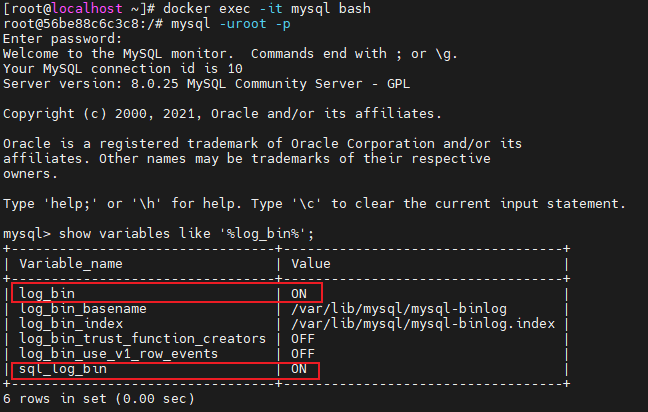
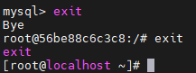
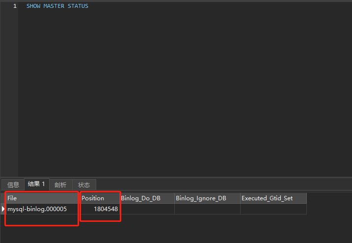
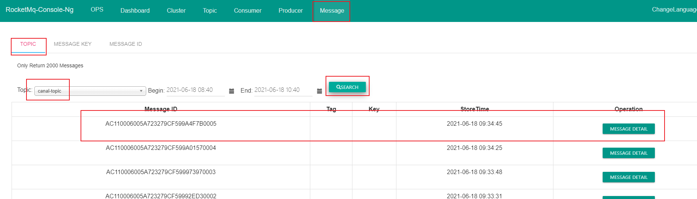

### Docker安装canal

安装canal需要有mysql，rabbitmq，若未安装，请参考文件”**Docker搭建Mysql8**“以及”**Docker安装RabbitMq**“。

安装前请确保数据库文件全部导入完毕，否则配置可能失效。

```shell
#进入容器
docker exec -it mysql bash
# 连接mysql,-p后输入密码
mysql -uroot -p
root
#查看是否开启日志
mysql> show variables like '%log_bin%';
```



#### 若无红框的内容，则参考以下步骤进行：[有则进行下一步]

若出现

```shell
bash:  xxx: command not found
```

需退出容器后才能执行以下步骤：[命令行输入exit]



1.1. 开启 MySQL 的 binlog 日志

修改 my.cnf, 添加配置项:

```shell
vi /mydata/mysql/my.cnf
```

修改配置文件my的内容


```shell
[mysqld]
# binlog 日志存放路径
log-bin=mysql-binlog
# 日志中记录每一行数据被修改的形式
binlog-format=ROW
# 当前机器的服务 ID, 如果为集群时不能重复
server_id=1
```

重启 mysql 服务

```shell
docker restart mysql
```

查看配置变量是否生效:

```shell
#进入容器
docker exec -it mysql bash
#连接mysql,-p后输入密码
mysql -uroot -p
root
#查看是否开启日志
mysql> show variables like '%log_bin%';
+---------------------------------+-----------------------------------+
| Variable_name                   | Value                             |
+---------------------------------+-----------------------------------+
| log_bin                         | ON                                |
| log_bin_basename                | /var/lib/mysql/mysql-binlog       |
| log_bin_index                   | /var/lib/mysql/mysql-binlog.index |
| log_bin_trust_function_creators | OFF                               |
| log_bin_use_v1_row_events       | OFF                               |
| sql_log_bin                     | ON                                |
+---------------------------------+-----------------------------------+
6 rows in set, 1 warning (0.00 sec)
```

### 若已开启日志，从此处继续：

#### 配置 mysql 数据库的 canal 用户

mysql -uroot -p 登录 mysql


若是这种形式[mysql>]的命令行，直接执行以下命令，若否，则登录后执行，登录命令参照图片显示。

创建并授权用户 canal;

```shell
CREATE USER canal IDENTIFIED BY 'canal';

GRANT SELECT, REPLICATION SLAVE, REPLICATION CLIENT ON *.* TO 'canal'@'%';

FLUSH PRIVILEGES;
```

### 安装单机 canal

```shell
#新增文件夹存放配置文件
mkdir /mydata/canal
#拉取指定版本镜像
docker pull canal/canal-server:v1.1.4
#启动canal
docker run -p 11111:11111 --name canal -id canal/canal-server:v1.1.4
#复制配置文件至指定文件夹
docker cp canal:/home/admin/canal-server/conf/canal.properties /mydata/canal
docker cp canal:/home/admin/canal-server/conf/example/instance.properties /mydata/canal
#停止
docker stop canal
#删除
docker rm canal
```

 配置文件

```shell
vi /mydata/canal/canal.properties
```

修改节点配置文件 canal.properties

```shell
#################################################
######### 		common argument		#############
#################################################
# tcp bind ip
canal.ip =
# register ip to zookeeper
canal.register.ip =
canal.port = 11111
canal.metrics.pull.port = 11112
# canal instance user/passwd
# canal.user = canal
# canal.passwd = E3619321C1A937C46A0D8BD1DAC39F93B27D4458

# canal admin config
#canal.admin.manager = 127.0.0.1:8089
canal.admin.port = 11110
canal.admin.user = admin
canal.admin.passwd = 4ACFE3202A5FF5CF467898FC58AAB1D615029441

canal.zkServers =
# flush data to zk
canal.zookeeper.flush.period = 1000
canal.withoutNetty = false
# 此处修改为RocketMQ
canal.serverMode = RocketMQ
# flush meta cursor/parse position to file
canal.file.data.dir = ${canal.conf.dir}
canal.file.flush.period = 1000
## memory store RingBuffer size, should be Math.pow(2,n)
canal.instance.memory.buffer.size = 16384
## memory store RingBuffer used memory unit size , default 1kb
canal.instance.memory.buffer.memunit = 1024 
## meory store gets mode used MEMSIZE or ITEMSIZE
canal.instance.memory.batch.mode = MEMSIZE
canal.instance.memory.rawEntry = true

## detecing config
canal.instance.detecting.enable = false
#canal.instance.detecting.sql = insert into retl.xdual values(1,now()) on duplicate key update x=now()
canal.instance.detecting.sql = select 1
canal.instance.detecting.interval.time = 3
canal.instance.detecting.retry.threshold = 3
canal.instance.detecting.heartbeatHaEnable = false

# support maximum transaction size, more than the size of the transaction will be cut into multiple transactions delivery
canal.instance.transaction.size =  1024
# mysql fallback connected to new master should fallback times
canal.instance.fallbackIntervalInSeconds = 60

# network config
canal.instance.network.receiveBufferSize = 16384
canal.instance.network.sendBufferSize = 16384
canal.instance.network.soTimeout = 30

# binlog filter config
canal.instance.filter.druid.ddl = true
canal.instance.filter.query.dcl = false
canal.instance.filter.query.dml = false
canal.instance.filter.query.ddl = false
canal.instance.filter.table.error = false
canal.instance.filter.rows = false
canal.instance.filter.transaction.entry = false

# binlog format/image check
canal.instance.binlog.format = ROW,STATEMENT,MIXED 
canal.instance.binlog.image = FULL,MINIMAL,NOBLOB

# binlog ddl isolation
canal.instance.get.ddl.isolation = false

# parallel parser config
canal.instance.parser.parallel = true
## concurrent thread number, default 60% available processors, suggest not to exceed Runtime.getRuntime().availableProcessors()
#canal.instance.parser.parallelThreadSize = 16
## disruptor ringbuffer size, must be power of 2
canal.instance.parser.parallelBufferSize = 256

# table meta tsdb info
canal.instance.tsdb.enable = true
canal.instance.tsdb.dir = ${canal.file.data.dir:../conf}/${canal.instance.destination:}
canal.instance.tsdb.url = jdbc:h2:${canal.instance.tsdb.dir}/h2;CACHE_SIZE=1000;MODE=MYSQL;
canal.instance.tsdb.dbUsername = canal
canal.instance.tsdb.dbPassword = canal
# dump snapshot interval, default 24 hour
canal.instance.tsdb.snapshot.interval = 24
# purge snapshot expire , default 360 hour(15 days)
canal.instance.tsdb.snapshot.expire = 360

# aliyun ak/sk , support rds/mq
canal.aliyun.accessKey =
canal.aliyun.secretKey =

#################################################
######### 		destinations		#############
#################################################
canal.destinations = example
# conf root dir
canal.conf.dir = ../conf
# auto scan instance dir add/remove and start/stop instance
canal.auto.scan = true
canal.auto.scan.interval = 5

canal.instance.tsdb.spring.xml = classpath:spring/tsdb/h2-tsdb.xml
#canal.instance.tsdb.spring.xml = classpath:spring/tsdb/mysql-tsdb.xml

canal.instance.global.mode = spring
canal.instance.global.lazy = false
canal.instance.global.manager.address = ${canal.admin.manager}
#canal.instance.global.spring.xml = classpath:spring/memory-instance.xml
canal.instance.global.spring.xml = classpath:spring/file-instance.xml
#canal.instance.global.spring.xml = classpath:spring/default-instance.xml

##################################################
######### 		     MQ 		     #############
##################################################
#此处修改为rocketmq的ip地址
canal.mq.servers = localhost:9876
canal.mq.retries = 3
canal.mq.batchSize = 16384
canal.mq.maxRequestSize = 1048576
canal.mq.lingerMs = 100
canal.mq.bufferMemory = 33554432
canal.mq.canalBatchSize = 50
canal.mq.canalGetTimeout = 100
canal.mq.flatMessage = true
canal.mq.compressionType = none
canal.mq.acks = all
#canal.mq.properties. =
canal.mq.producerGroup = canal-topic
# Set this value to "cloud", if you want open message trace feature in aliyun.
canal.mq.accessChannel = local
# aliyun mq namespace
#canal.mq.namespace =

##################################################
#########     Kafka Kerberos Info    #############
##################################################
canal.mq.kafka.kerberos.enable = false
canal.mq.kafka.kerberos.krb5FilePath = "../conf/kerberos/krb5.conf"
canal.mq.kafka.kerberos.jaasFilePath = "../conf/kerberos/jaas.conf"
```

实例配置文件 instance.properties

```shell
vi /mydata/canal/instance.properties
```

```shell
#################################################
## mysql serverId , v1.0.26+ will autoGen
# canal.instance.mysql.slaveId=0

canal.instance.gtidon=false

# 填写数据库ip地址
canal.instance.master.address=localhost:3306
# 确保数据库文件全部执行完毕后，填写执行命令`SHOW MASTER STATUS`后的File内容
canal.instance.master.journal.name=mysql-binlog.000030
# 填写执行命令`SHOW MASTER STATUS`后的POSITION内容
canal.instance.master.position=1175400
canal.instance.master.timestamp=
canal.instance.master.gtid=

# rds oss binlog
canal.instance.rds.accesskey=
canal.instance.rds.secretkey=
canal.instance.rds.instanceId=

# table meta tsdb info
canal.instance.tsdb.enable=false
#canal.instance.tsdb.url=jdbc:mysql://127.0.0.1:3306/canal_tsdb
#canal.instance.tsdb.dbUsername=canal
#canal.instance.tsdb.dbPassword=canal

#canal.instance.standby.address =
#canal.instance.standby.journal.name =
#canal.instance.standby.position =
#canal.instance.standby.timestamp =
#canal.instance.standby.gtid=

# username/password
canal.instance.dbUsername=canal
canal.instance.dbPassword=canal
canal.instance.connectionCharset = UTF-8
# enable druid Decrypt database password
canal.instance.enableDruid=false
#canal.instance.pwdPublicKey=MFwwDQYJKoZIhvcNAQEBBQADSwAwSAJBALK4BUxdDltRRE5/zXpVEVPUgunvscYFtEip3pmLlhrWpacX7y7GCMo2/JM6LeHmiiNdH1FWgGCpUfircSwlWKUCAwEAAQ==

# table regex
canal.instance.filter.regex=mall4cloud_product.spu:*,mall4cloud_product.category:*,mall4cloud_product.brand:*,mall4cloud_product.spu_tag_reference:*,mall4cloud_multishop.shop_detail:*,mall4cloud_product.spu_extension:*,mall4cloud_product.sku:*,mall4cloud_product.sku_stock:*,mall4cloud_order.order:*
# table black regex
canal.instance.filter.black.regex=mysql\\.slave_.*
# table field filter(format: schema1.tableName1:field1/field2,schema2.tableName2:field1/field2)
#canal.instance.filter.field=test1.t_product:id/subject/keywords,test2.t_company:id/name/contact/ch
# table field black filter(format: schema1.tableName1:field1/field2,schema2.tableName2:field1/field2)
#canal.instance.filter.black.field=test1.t_product:subject/product_image,test2.t_company:id/name/contact/ch

# mq config
canal.mq.topic=canal-topic
# dynamic topic route by schema or table regex
#canal.mq.dynamicTopic=mytest1.user,mytest2\\..*,.*\\..*
canal.mq.partition=0
# hash partition config
#canal.mq.partitionsNum=3
#canal.mq.partitionHash=test.table:id^name,.*\\..*
#################################################
```




重启canal 服务

```shell
docker run \
--name canal -d \
-p 11111:11111 \
-v /mydata/canal/conf/example:/home/admin/canal-server/conf/example \
-v /mydata/canal/conf/canal.properties:/home/admin/canal-server/conf/canal.properties \
-v /mydata/canal/logs:/home/admin/canal-server/logs \
canal/canal-server:v1.1.4
```

此时已经配置canal通过rocketmq监听mysql数据库，可以通过修改数据库文件来观察rocketmq是否有监听成功。

监听数据库范围在` /mydata/canal/instance.properties`

```shell
#只有修改这些数据库才会监听
canal.instance.filter.regex=mall4cloud_product.spu:*,mall4cloud_product.category:*,mall4cloud_product.brand:*,mall4cloud_product.spu_tag_reference:*,mall4cloud_multishop.shop_detail:*,mall4cloud_product.spu_extension:*,mall4cloud_product.sku:*,mall4cloud_product.sku_stock:*
```

