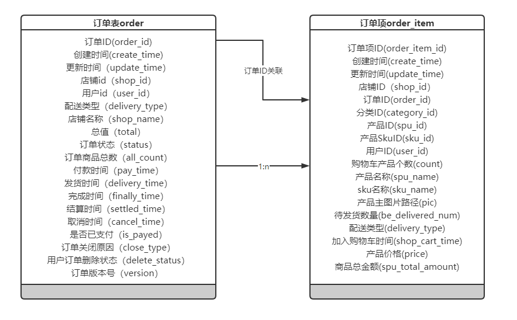
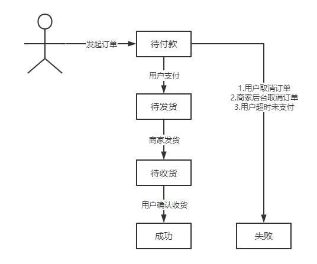

## 订单表结构

### 1 数据库结构



一个订单表(order)中每一项对应多个`order_item`，通过`order_id`关联

- 一个order记录每个订单的状态、时间、总金额等

- 一个order有多个order_item，每个订单项记录每件商品的信息

#### 1.1 Order-订单

每一次下单即生成一条订单记录，其中有多件或一件商品。

```java
	/**
     * 订单ID
     */
    private Long orderId;

    /**
     * 用户ID
     */
    private Long userId;

	/**
     * 店铺id
     */
    private Long shopId;

	/**
	 * 店铺名称
	 */
	private String shopName;

    /**
     * 订单状态 1:待付款 2:待发货 3:待收货(已发货) 5:成功 6:失败
     */
    private Integer status;

    /**
     * 订单关闭原因 1-超时未支付 4-买家取消
     */
    private Integer closeType;

	/**
     * 总值
     */
    private Long total;

    /**
     * 配送类型 :无需快递
     */
    private Integer deliveryType;

    /**
     * 订单商品总数
     */
    private Integer allCount;

    /**
     * 付款时间
     */
    private Date payTime;

    /**
     * 发货时间
     */
    private Date deliveryTime;

    /**
     * 完成时间
     */
    private Date finallyTime;

    /**
     * 取消时间
     */
    private Date cancelTime;

    /**
     * 是否已支付，1.已支付0.未支付
     */
    private Integer isPayed;

    /**
     * 用户订单删除状态，0：没有删除， 1：回收站， 2：永久删除
     */
    private Integer deleteStatus;
```

每个订单关联一个用户(`user_id`)，一家店铺(`shop_id`)

- `status`订单状态一共有六种：1:待付款 2:待发货 3:待收货(已发货) 5:成功 6:失败

**状态转换如下：**



- `closeType`订单关闭原因有两种：1:超时未支付 2:买家取消

- `total`总值，指一个订单内所有商品的总金额，即这个订单关联的订单项中`spuTotalAmount`的总和
- `deliveryType`配送类型，目前只有无需快递这一类型
- `allCount`订单商品总数，即一个订单中包含的商品总数

#### 1.2 order_item-订单项

每个订单根据order_id关联订单项表，一个订单可以有多个订单项

```java
	/**
     * 订单项ID
     */
    private Long orderItemId;

    /**
     * 店铺id
     */
    private Long shopId;

    /**
     * 订单id
     */
    private Long orderId;

    /**
     * 产品ID
     */
    private Long spuId;

    /**
     * 产品SkuID
     */
    private Long skuId;

    /**
     * 用户Id
     */
    private Long userId;

    /**
     * 购物车产品个数
     */
    private Integer count;

    /**
     * 产品名称
     */
    private String spuName;

    /**
     * sku名称
     */
    private String skuName;

    /**
     * 产品主图片路径
     */
    private String pic;

    /**
     * 单个orderItem的配送类型 无需快递
     */
    private Integer deliveryType;

    /**
     * 加入购物车时间
     */
    private Date shopCartTime;

    /**
     * 产品价格
     */
    private Long price;

    /**
     * 商品总金额
     */
    private Long spuTotalAmount;
```

- `count`购物车产品个数：添加到购物车的数量
- `spuTotalAmount`商品总金额：为产品价格`price`与购物车产品个数`count`的乘积

### 2 界面

