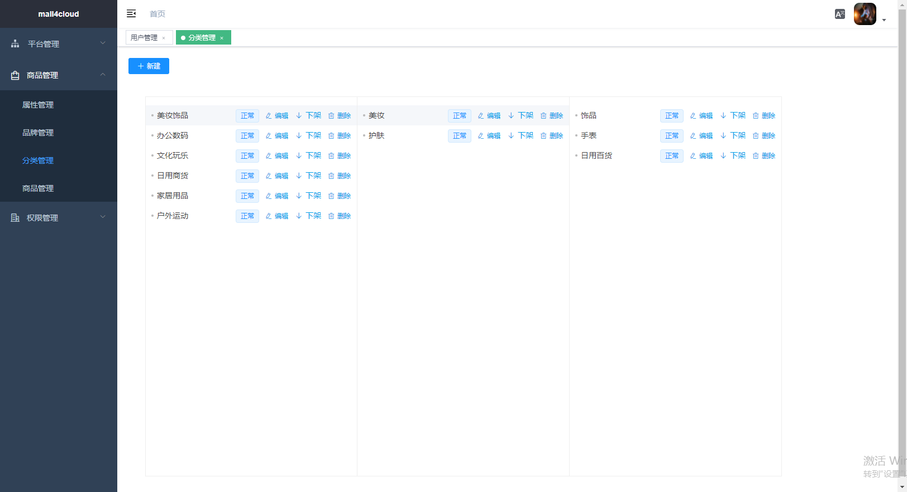
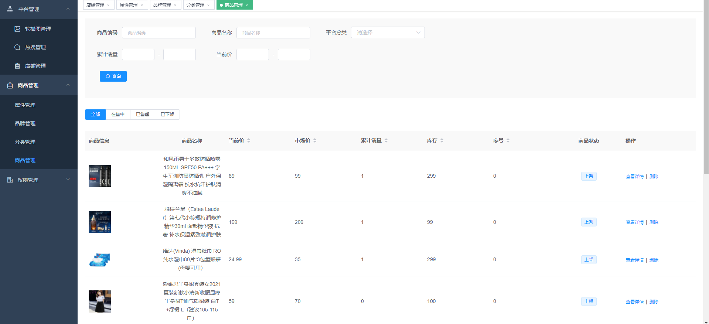

# README


## 前言

本商城是基于Spring Cloud、Nacos、Seata、Mysql、Redis、RocketMQ、canal、ElasticSearch、minio的微服务B2B2C电商商城系统，采用主流的互联网技术架构、全新的UI设计、支持集群部署、服务注册和发现以及拥有完整的订单流程等，代码完全开源，没有任何二次封装，是一个非常适合二次开发的电商平台系统。

本商城致力于为中大型企业打造一个功能完整、易于维护的微服务B2B2C电商商城系统，采用主流微服务技术实现。后台管理系统包含平台管理，店铺管理、商品管理、订单管理、规格管理、权限管理、资源管理等模块


## 授权

除开源版本外，本商城还提供商业版本的商城，欲知详情，请访问官网。

商城官网：https://www.mall4j.com

商城使用 AGPLv3 开源，请遵守 AGPLv3 的相关条款，或者联系作者获取商业授权(https://www.mall4j.com)


## 项目链接

JAVA后台：https://gitee.com/gz-yami/mall4cloud

平台端：https://gitee.com/gz-yami/mall4cloud-platform

商家端：https://gitee.com/gz-yami/mall4cloud-multishop

uni-app：https://gitee.com/gz-yami/mall4cloud-uniapp

### 1.启动

- 安装node模块 （不要用cnpm，否则会出现不可预知的后果）

```
npm install
```

- 运行

```
npm run dev
```

- 部署

```
npm run build:prod
```

## 技术介绍

后台基础框架采用使用mit开源协议的 `vue-element-admin`

具体可以查看 [vue-element-admin 介绍](https://panjiachen.gitee.io/vue-element-admin-site/zh/guide/)

https://panjiachen.gitee.io/vue-element-admin-site/zh/guide/

```
├── build                      # 构建相关
├── public                     # 静态资源
│   │── favicon.ico            # favicon图标
│   └── index.html             # html模板
├── src                        # 源代码
│   ├── api                    # 所有请求(根据不同后台不同的服务分包)
│   ├── assets                 # 主题 字体等静态资源
│   ├── components             # 全局公用组件
│   ├── directive              # 全局指令
│   ├── filters                # 全局 filter
│   ├── icons                  # 项目所有 svg icons
│   ├── lang                   # 国际化 language
│   ├── layout                 # 全局 layout
│   ├── router                 # 路由
│   ├── store                  # 全局 store管理
│   ├── styles                 # 全局样式
│   ├── utils                  # 全局公用方法
│   ├── views                  # views 所有页面
│   ├── App.vue                # 入口页面
│   ├── main.js                # 入口文件 加载组件 初始化等
│   └── permission.js          # 权限管理
├── tests                      # 测试
├── .env.xxx                   # 环境变量配置
├── .eslintrc.js               # eslint 配置项
├── .babelrc                   # babel-loader 配置
├── .travis.yml                # 自动化CI配置
├── vue.config.js              # vue-cli 配置
├── postcss.config.js          # postcss 配置
└── package.json               # package.json
```


## 运行相关截图

### 后台截图






## 提交反馈
- Mall4j官网 https://www.mall4j.com
- 商务合作微信


- mall4j开源技术QQ群：722835385


## 你的点赞鼓励，是我们前进的动力~
## 你的点赞鼓励，是我们前进的动力~
## 你的点赞鼓励，是我们前进的动力~
